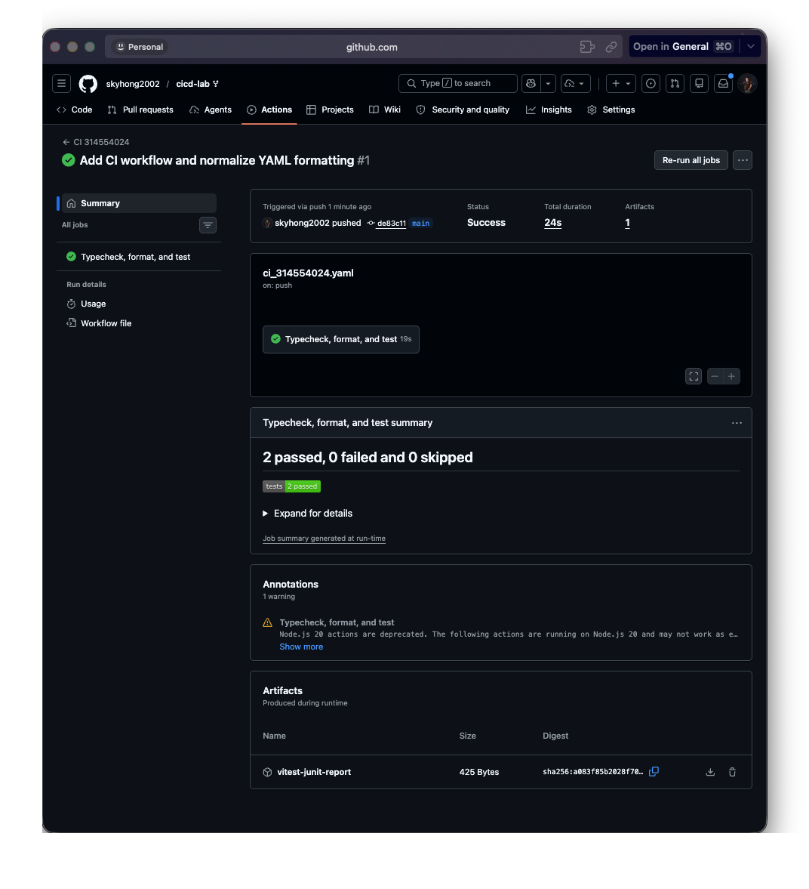
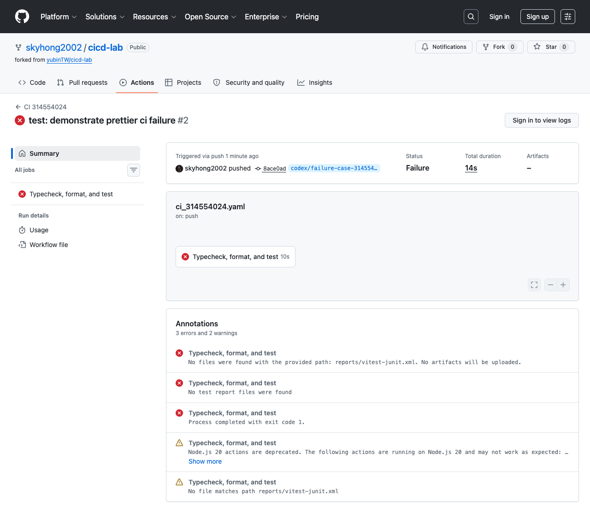

# TSMC_HW4_CICD 作業報告

**Student ID:** 314554024  
**Name:** 洪軾凱  
**Repository:** <https://github.com/skyhong2002/cicd-lab>  
**Workflow file:** `.github/workflows/ci_314554024.yaml`

## 1. CI Pipeline 說明

本次作業新增 `.github/workflows/ci_314554024.yaml`，讓 GitHub Actions 在 `push` 時自動執行。Pipeline 會檢查 TypeScript 型別、Prettier 格式與 Vitest 測試；任一檢查失敗時，對應 step 會回傳非 0 exit code，因此整個 workflow 會顯示 failed。

```yaml
name: CI 314554024
on:
  push:
    branches: ['**']
  pull_request:
permissions:
  contents: read
  checks: write
jobs:
  quality:
    name: Typecheck, format, and test
    runs-on: ubuntu-latest
    steps:
      - uses: actions/checkout@v5
      - uses: actions/setup-node@v5
        with: { node-version: '22', cache: npm }
      - run: npm ci
      - run: npm run typecheck
      - run: npm run format:check
      - name: Run tests
        run: npm test -- --reporter=default --reporter=junit
```

| 檢查項目             | 實作方式                                | 目的                          |
| -------------------- | --------------------------------------- | ----------------------------- |
| TypeScript typecheck | `npm run typecheck`                     | 執行 `tsc --noEmit`，檢查型別 |
| Prettier check       | `npm run format:check`                  | 確認程式碼與設定檔格式        |
| Test report          | Vitest JUnit + `dorny/test-reporter@v2` | 在 Actions 結果頁顯示測試結果 |
| Artifact             | `actions/upload-artifact@v7`            | 保存 `vitest-junit-report`    |

---

## 2. CI 執行結果截圖

成功執行結果顯示 workflow 由 `push` 觸發，狀態為 **Success**，job `Typecheck, format, and test` 成功完成，測試摘要顯示 **2 passed, 0 failed, 0 skipped**，並產生 `vitest-junit-report` artifact。



**圖 1：CI 314554024 workflow 成功執行結果**

| 項目             | 結果                                                    |
| ---------------- | ------------------------------------------------------- |
| Workflow         | `CI 314554024`                                          |
| Trigger / Branch | `push` / `main`                                         |
| Status / Job     | `Success` / `Typecheck, format, and test`               |
| Tests / Artifact | `2 passed, 0 failed, 0 skipped` / `vitest-junit-report` |

---

## 3. 失敗案例說明

我另外建立 `codex/failure-case-314554024` branch，故意製造 **Prettier 格式錯誤**。這個案例不改變程式邏輯，只讓格式檢查失敗，用來證明 pipeline 會顯示 failed。

```diff
  app.get('/health', async () => {
    return {
-      status: 'ok'
+                 status: 'ok'
    };
  });
```



**圖 2：故意製造 Prettier 格式錯誤後，GitHub Actions 顯示 failed**

失敗流程：push 到 `codex/failure-case-314554024` 後，GitHub Actions 執行 `npm run format:check`；Prettier 偵測到 `src/app.ts` 格式錯誤並回傳 exit code 1，因此 `Prettier check` step 與整個 workflow 皆失敗。

```text
Checking formatting...
[warn] src/app.ts
[warn] Code style issues found in the above file. Run Prettier with --write to fix.
Process completed with exit code 1.
```

---

## 4. 修正方式與結論

修正方式是在本機先執行 Prettier 自動格式化，再確認格式檢查通過：

```bash
npm run format
npm run format:check
git add .
git commit -m "style: fix prettier formatting"
git push
```

本次 CI pipeline 已完成作業基本要求：在 push 時自動執行，包含 TypeScript typecheck、Prettier check 與 Test；任一檢查失敗時 workflow 會顯示 failed；測試結果會顯示在 GitHub Actions 結果頁，並以 artifact 保存。

此設計可以在程式碼進入主要分支前及早發現型別、格式與測試問題，降低錯誤進入 main branch 的機率。
